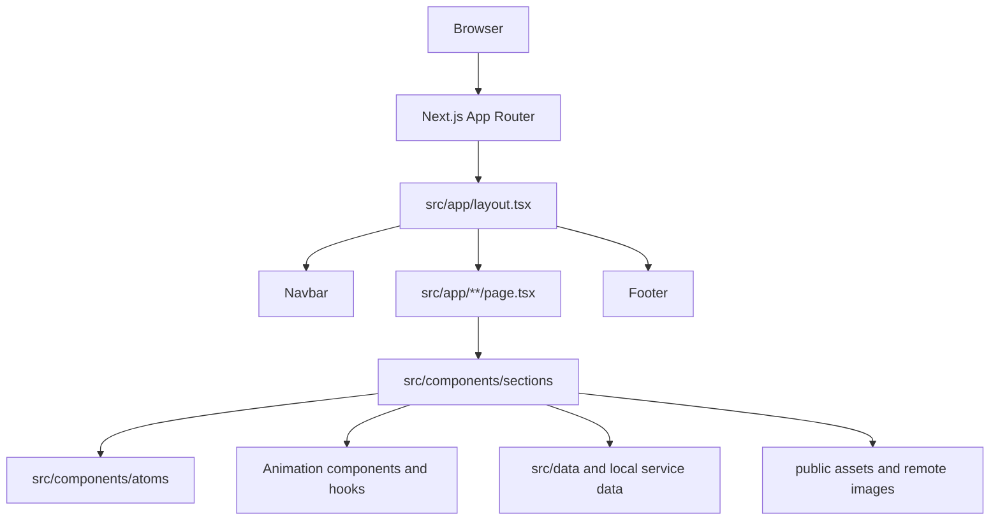

# Current Architecture

This document describes the code that currently exists in the repository. It is a working map, not a proposal for an ideal future system.

## System at a glance

## Routes

| Route | Entry | Composition or data |
| --- | --- | --- |
| `/` | `src/app/page.tsx` | Hero, collage, trust, about, services, marquee, selected work, process, proof, FAQ, CTA; reads `WORK_ITEMS` |
| `/about` | `src/app/about/page.tsx` | About hero, trust, statement, company specs, team, FAQ, CTA |
| `/services` | `src/app/services/page.tsx` | Service hero, service list, process, CTA |
| `/works` | `src/app/works/page.tsx` | Work hero and all work items |
| `/works/[slug]` | `src/app/works/[slug]/page.tsx` | Work detail lookup and `notFound()` fallback |
| `/events` | `src/app/events/page.tsx` | Event hero and event listing |
| `/events/[slug]` | `src/app/events/[slug]/page.tsx` | Event detail lookup and `notFound()` fallback |
| `/gallery` | `src/app/gallery/page.tsx` | Gallery hero, bento gallery, CTA |
| `/contact` | `src/app/contact/page.tsx` | Contact hero and contact form section |
| `/blog` and `/blog/[slug]` | `src/app/blog/**` | Blog implementation and data need verification before being treated as a stable feature |
| `/privacy-policy` and `/terms-and-conditions` | matching `page.tsx` files | Static legal pages |

`src/app/layout.tsx` owns the global fonts, metadata, theme attribute, navbar, footer, and page shell. `src/app/not-found.tsx` is the custom not-found page.

## Code organization

- `src/components/atoms`: reusable primitives such as `Button`, `Container`, `Heading`, `Input`, `Logo`, `NavLink`, and `Section`.
- `src/components/navigation`: global `Navbar` and `Footer`.
- `src/components/sections`: page-level presentation grouped by domain: home, about, services, works, events, gallery, contact, FAQ, and blog.
- `src/components/Animation`: reusable visual effects and animation wrappers using Framer Motion, GSAP, OGL, and shader components.
- `src/components/hooks`: reusable hooks, currently including sticky-stack and scroll-trigger behavior.
- `src/data/works.ts`: primary work/project data used by work pages and the homepage.
- `src/data/events.ts`: event data used by event pages.
- `src/data/content.ts`: separate sample work/article model; this currently overlaps with the primary data model and needs an ownership decision.
- `src/components/sections/services/Service.ts` and `ServicePhase.ts`: service and process data stored beside their presentation components.
- `src/lib/utils.ts`: shared utility functions, including `cn`.

## Client boundaries and state

The root layout and most route files are server components. Interactive sections opt into client components for local state, event handlers, browser APIs, GSAP, Framer Motion, forms, accordions, filters, and WebGL-style effects.

There is no global client state store. State is local to the component that owns the interaction. This is appropriate for the current portfolio scope, but contact submission, analytics consent, and other cross-page concerns will need an explicit boundary when those features are added.

## Current risks and technical debt

- `npm run lint` currently reports 3 errors and 28 warnings. The errors are in `TextType.tsx`, `Navbar.tsx`, and `ContactHero.tsx`.
- `TeamMember.tsx` contains an unused internal Next.js import: `Span` from `next/dist/trace`.
- Several components use raw `` elements instead of `next/image`; remote image domains and asset ownership should be standardized.
- `BentoGallery .tsx` has a trailing space in its filename.
- Work/article data is duplicated between `src/data/works.ts`, `src/data/content.ts`, and local service data.
- Some animation components and hooks appear unused and should be confirmed before removal.
- Some dependencies appear unused, including `class-variance-authority` and `lenis`.
- The current not-found page is only a placeholder.

## Post-frontend delivery order

After the visual frontend is stable, complete the project in this order:

1. Resolve lint and TypeScript errors.
2. Decide the authoritative data model for works, services, events, and articles.
3. Replace placeholders and broken assets with owned production content.
4. Connect the contact form to a real validated server endpoint or form provider.
5. Add SEO metadata, Open Graph images, sitemap, robots rules, and structured data.
6. Test responsive layouts, keyboard access, reduced motion, image loading, and route fallbacks.
7. Add analytics and error monitoring only after privacy and consent behavior are defined.
8. Run a production build, deploy a preview, and verify every route on the deployed environment.
