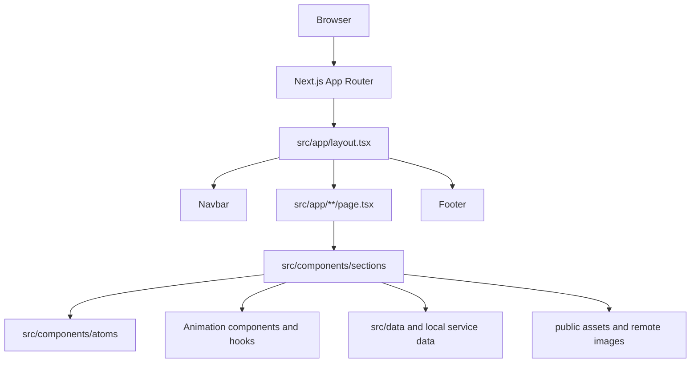

# Current Architecture

This document describes the code that currently exists in the repository. It is a working map, not a proposal for an ideal future system.

## System at a glance

## Routes

| Route | Entry | Composition or data |
| --- | --- | --- |
| `/` | `src/app/page.tsx` | Hero, collage, trust, about, services, marquee, selected work, process, proof, FAQ, CTA; reads `WORK_ITEMS` |
| `/about` | `src/app/about/page.tsx` | About hero, trust, statement, company specs, team, FAQ, CTA |
| `/services` | `src/app/services/page.tsx` | Service hero, service list, process, CTA |
| `/works` | `src/app/works/page.tsx` | Work hero and all work items |
| `/works/[slug]` | `src/app/works/[slug]/page.tsx` | Work detail lookup and `notFound()` fallback |
| `/events` | `src/app/events/page.tsx` | Event hero and event listing |
| `/events/[slug]` | `src/app/events/[slug]/page.tsx` | Event detail lookup and `notFound()` fallback |
| `/gallery` | `src/app/gallery/page.tsx` | Gallery hero, bento gallery, CTA |
| `/contact` | `src/app/contact/page.tsx` | Contact hero and contact form section |
| `/privacy-policy` and `/terms-and-conditions` | matching `page.tsx` files | Static legal pages |

`src/app/layout.tsx` owns the global fonts, metadata, theme attribute, navbar, footer, and page shell. `src/app/not-found.tsx` is the custom not-found page.

Blog section components exist under `src/components/sections/blog`, but there is no `src/app/blog` route in the current app. Do not present `/blog` as an available page until routes and content are implemented and reviewed.

## Code organization

- `src/components/atoms`: reusable primitives such as `Button`, `Container`, `Heading`, `Input`, `Logo`, `NavLink`, and `Section`.
- `src/components/navigation`: global `Navbar` and `Footer`.
- `src/components/sections`: page-level presentation grouped by domain: home, about, services, works, events, gallery, contact, FAQ, and blog.
- `src/components/Animation`: reusable visual effects and animation wrappers using Framer Motion, GSAP, OGL, and shader components.
- `src/components/hooks`: reusable hooks, currently including sticky-stack and scroll-trigger behavior.
- `src/data/works.ts`: primary work/project data used by work pages and the homepage.
- `src/data/events.ts`: event data used by event pages.
- `src/data/content.ts`: separate sample work/article model; this currently overlaps with the primary data model and needs an ownership decision.
- `src/components/sections/services/Service.ts` and `ServicePhase.ts`: service and process data stored beside their presentation components.
- `src/lib/utils.ts`: shared utility functions, including `cn`.

## Client boundaries and state

The root layout and most route files are server components. Interactive sections opt into client components for local state, event handlers, browser APIs, GSAP, Framer Motion, forms, accordions, filters, and WebGL-style effects.

There is no global client state store. State is local to the component that owns the interaction. This is appropriate for the current portfolio scope, but contact submission, analytics consent, and other cross-page concerns will need an explicit boundary when those features are added.

## Current risks and technical debt

- Current check status (2026-09-27): `npx tsc --noEmit` passes. `npm run lint` fails with one `react-hooks/set-state-in-effect` error in `src/components/navigation/Navbar.tsx` at the theme-hydration effect. The production build passed during the prior audit, but should be rerun for final sign-off.
- The contact form currently logs submitted values in the browser and shows a local success state; it is not connected to a delivery service. The newsletter form is also frontend-only. Until backend integration, the UI must not imply that a message or subscription was actually delivered.
- Some displayed portfolio, event, and service content is still sample or placeholder content and needs owner review for accuracy and rights to use.
- Frontend implementation edits from the current audit are unapproved and awaiting owner review. Their rationale and review status are recorded in `decision.md`; do not treat them as accepted fixes until reviewed.
- Several components use raw `` elements instead of `next/image`; remote image domains and asset ownership should be standardized.
- Work/article data is split between `src/data/works.ts`, `src/data/content.ts`, and local service data; `src/data/content.ts` is sample data and should not become a second source of truth without an explicit decision.
- Some animation components and hooks appear unused and should be confirmed before removal.
- Some dependencies may be unused, including `class-variance-authority` and `lenis`; confirm with repository-wide usage checks before removing anything.
- The current not-found page and route fallback behavior need visual and interaction review on desktop and mobile.

## Frontend completion gate

Frontend completion means the owner has reviewed and accepted the user-facing experience. It does not mean backend integrations are finished. Do not start backend implementation until the following are reviewed and signed off:

1. **Routes and content:** Every agreed route exists, navigation and footer links resolve, detail routes handle unknown slugs, and all sample text, project details, images, legal copy, and contact information are approved or replaced.
2. **Responsive layout:** Each route has been checked at agreed mobile, tablet, and desktop sizes. No unintended horizontal overflow, clipped text, overlapping controls, broken media, or layout shifts remain.
3. **Interactions and states:** Menus, links, accordions, filters, animations, and forms behave as designed. Forms have reviewed idle, validation, pending, success, and failure states. Until a real endpoint exists, the UI clearly communicates that submission is a prototype and does not claim delivery.
4. **Accessibility and motion:** Keyboard navigation, visible focus, semantic headings and labels, useful image alternatives, contrast, reduced-motion behavior, and screen-reader status messages have been checked.
5. **Quality checks:** `npm run lint`, `npx tsc --noEmit`, and `npm run build` pass. Critical route and interaction smoke checks pass on the production build.
6. **Owner sign-off:** The owner has reviewed the deployed or preview experience and explicitly accepted the content, responsive behavior, visual details, and remaining known limitations.

Record the review date, viewport/browser coverage, known exceptions, and owner approval before declaring the frontend phase complete. A passing build alone is not frontend sign-off.

## Backend phase after frontend sign-off

Once the frontend gate above is accepted, move into backend delivery in this order:

1. Agree the data ownership/model for works, services, and events.
2. Connect contact and newsletter forms to validated delivery endpoints and real success/failure handling.
3. Define privacy and consent behavior before adding analytics or monitoring.
4. Complete production SEO and deployment work, including Open Graph, sitemap, robots rules, and structured data.
5. Verify all routes and integrations in a deployed preview.
